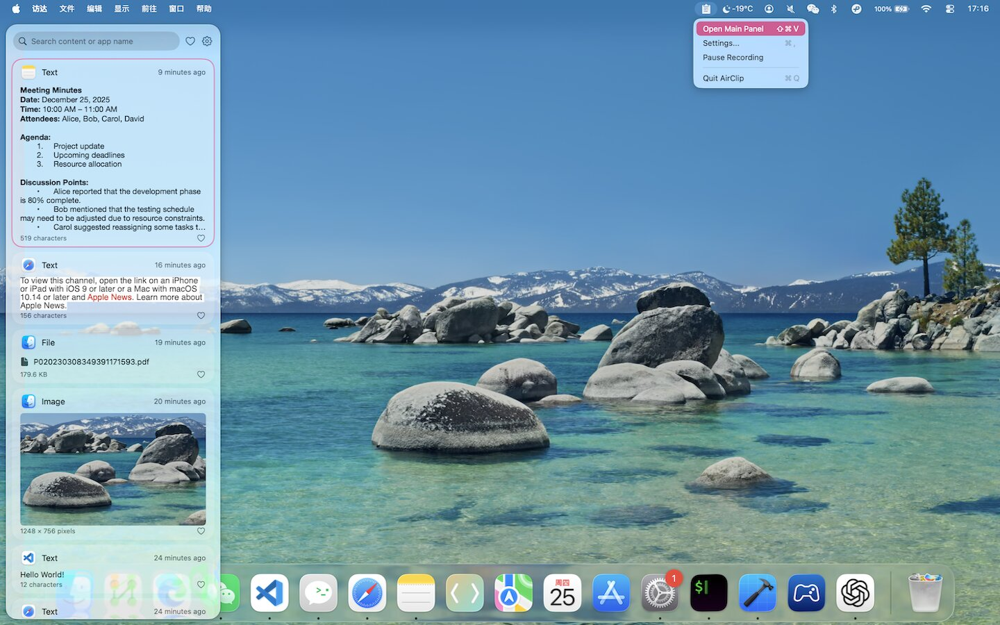
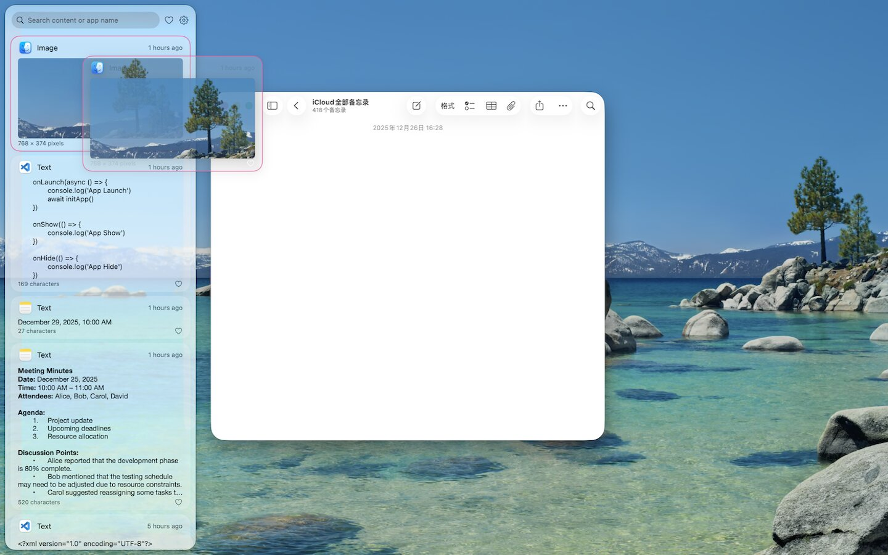

# AirClip

English | [简体中文](README.zh-CN.md)

**A clipboard history manager for Mac and iPhone.** AirClip records what you copy, keeps it searchable, and syncs it across your devices through iCloud.

<p align="center">
  
</p>
<p align="center">
  
</p>

## Features

- **Clipboard history** — text, rich text, images, files, and links
- **macOS menu bar app** — no Dock icon; open a left, bottom, or floating panel
- **Global hotkey** — `⌘⇧V` by default, fully customizable
- **Search and filters** — find by content or source app; pin favorites
- **Paste options** — copy only, copy and paste, or always paste as plain text
- **Privacy controls** — ignore apps, content types, and keywords
- **Storage limits** — cap item count, size, text length, and retention
- **iCloud sync** — private CloudKit database between Mac and iPhone
- **Launch at login** on macOS

## Requirements

- macOS 26 or later / iOS 26 or later
- Xcode 26 or later
- An Apple Developer account (required for code signing and iCloud)

## Getting Started

```bash
git clone https://github.com/visionchang/AirClip.git
cd AirClip
open AirClip.xcodeproj
```

This repository ships with placeholder signing identities. Replace them with your own before building, or Xcode will fail to sign the app and CloudKit sync will not work.

| Placeholder | Replace with |
|---|---|
| `com.example.AirClip` / `com.example.AirClip-iOS` | Your bundle identifiers |
| `iCloud.com.example.AirClip` | A CloudKit container you create in Apple Developer |
| `DEVELOPMENT_TEAM` (empty) | Your team in Xcode → Signing & Capabilities |

Update these files:

- `AirClip.xcodeproj/project.pbxproj`
- `AirClip/AirClip.entitlements`
- `AirClip-iOS/AirClip_iOS.entitlements`
- `AirClip/App/AirClipApp.swift`
- `AirClip-iOS/App/AirClipApp_iOS.swift`
- `AirClip/Managers/iCloudSyncManager.swift`
- `AirClip/Views/Settings/SyncSettingsView.swift`
- `AirClip-iOS/Views/SettingsView_iOS.swift`

Use the **same** CloudKit container ID on macOS and iOS.

Then select a scheme and run:

| Scheme | Description |
|---|---|
| **AirClip** | macOS menu bar app |
| **AirClip-iOS** | iOS companion |

On macOS, grant Accessibility permission so AirClip can paste into the frontmost app.

## Project Layout

```
AirClip/            macOS app (models, managers, most SwiftUI views)
AirClip-iOS/        iOS entry point and platform-specific UI
AirClip.xcodeproj/  Shared Xcode project
```

Shared data lives in `AirClip/Models/Item.swift`. Both targets persist with SwiftData and sync through CloudKit.

## License

[MIT](LICENSE) © 2025 Vision Studio
