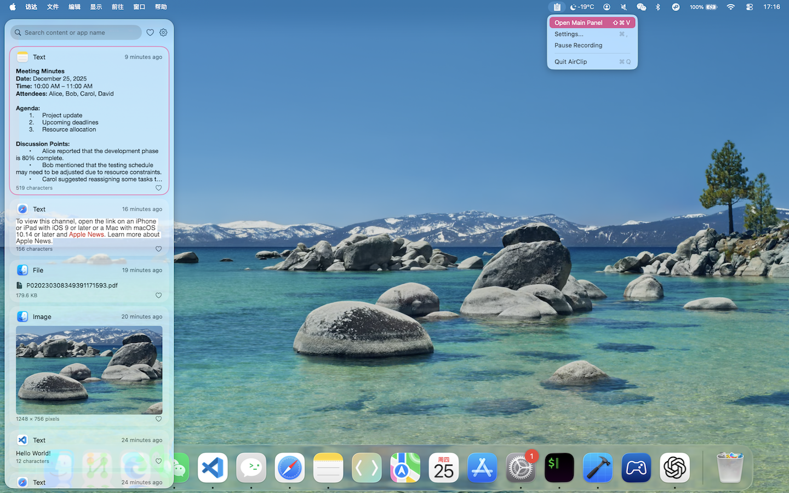
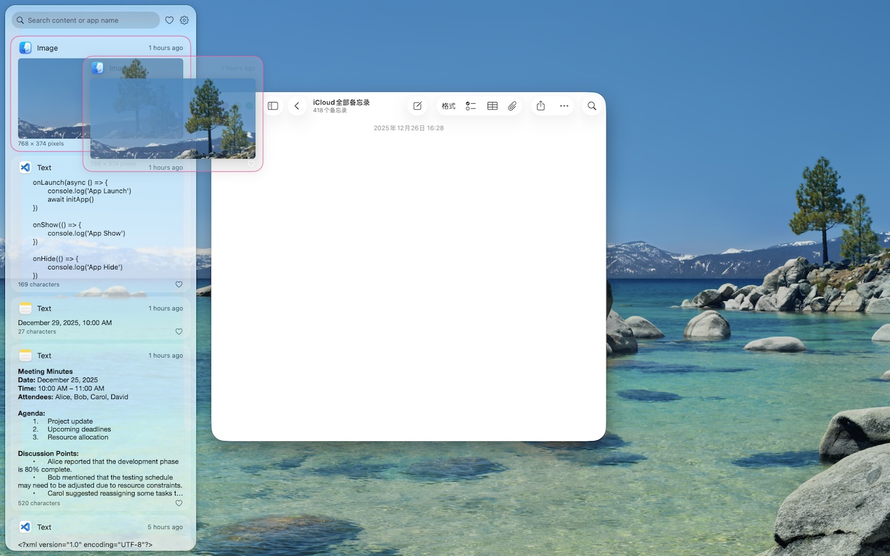

# AirClip

[English](README.md) | 简体中文

**面向 Mac 和 iPhone 的剪贴板历史管理工具。** AirClip 会记录你复制过的内容，支持搜索，并通过 iCloud 在设备间同步。

<p align="center">
  
</p>
<p align="center">
  
</p>

## 功能

- **剪贴板历史** — 文本、富文本、图片、文件和链接
- **macOS 菜单栏应用** — 无 Dock 图标；可从左侧、底部弹出，或使用独立窗口
- **全局快捷键** — 默认 `⌘⇧V`，可自定义
- **搜索与筛选** — 按内容或来源应用查找；支持收藏
- **粘贴选项** — 仅复制、复制并粘贴，或始终以纯文本粘贴
- **隐私控制** — 可忽略指定应用、内容类型和关键字
- **存储上限** — 可限制条数、体积、文本长度和保留时间
- **iCloud 同步** — 通过 CloudKit 私有数据库在 Mac 与 iPhone 之间同步
- **开机启动**（macOS）

## 系统要求

- macOS 26 或更高版本 / iOS 26 或更高版本
- Xcode 26 或更高版本
- Apple Developer 账号（用于代码签名和 iCloud）

## 开始使用

```bash
git clone https://github.com/visionchang/AirClip.git
cd AirClip
open AirClip.xcodeproj
```

仓库中的签名信息是占位符。构建前请替换成你自己的，否则无法签名，也无法使用 CloudKit 同步。

| 占位符 | 替换为 |
|---|---|
| `com.example.AirClip` / `com.example.AirClip-iOS` | 你的 Bundle ID |
| `iCloud.com.example.AirClip` | 你在 Apple Developer 中创建的 CloudKit 容器 |
| `DEVELOPMENT_TEAM`（当前为空） | 在 Xcode → Signing & Capabilities 中选择你的 Team |

需要修改的文件：

- `AirClip.xcodeproj/project.pbxproj`
- `AirClip/AirClip.entitlements`
- `AirClip-iOS/AirClip_iOS.entitlements`
- `AirClip/App/AirClipApp.swift`
- `AirClip-iOS/App/AirClipApp_iOS.swift`
- `AirClip/Managers/iCloudSyncManager.swift`
- `AirClip/Views/Settings/SyncSettingsView.swift`
- `AirClip-iOS/Views/SettingsView_iOS.swift`

macOS 与 iOS 必须使用**同一个** CloudKit 容器 ID。

然后选择对应 Scheme 运行：

| Scheme | 说明 |
|---|---|
| **AirClip** | macOS 菜单栏应用 |
| **AirClip-iOS** | iOS 配套应用 |

在 macOS 上需要授予辅助功能权限，AirClip 才能把内容粘贴到当前前台应用。

## 仓库结构

```
AirClip/            macOS 应用（模型、管理器、大部分 SwiftUI 视图）
AirClip-iOS/        iOS 入口与平台相关界面
AirClip.xcodeproj/  共用 Xcode 工程
```

共享数据模型位于 `AirClip/Models/Item.swift`。两个 Target 都使用 SwiftData 持久化，并通过 CloudKit 同步。

## 许可

[MIT](LICENSE) © 2025 Vision Studio
